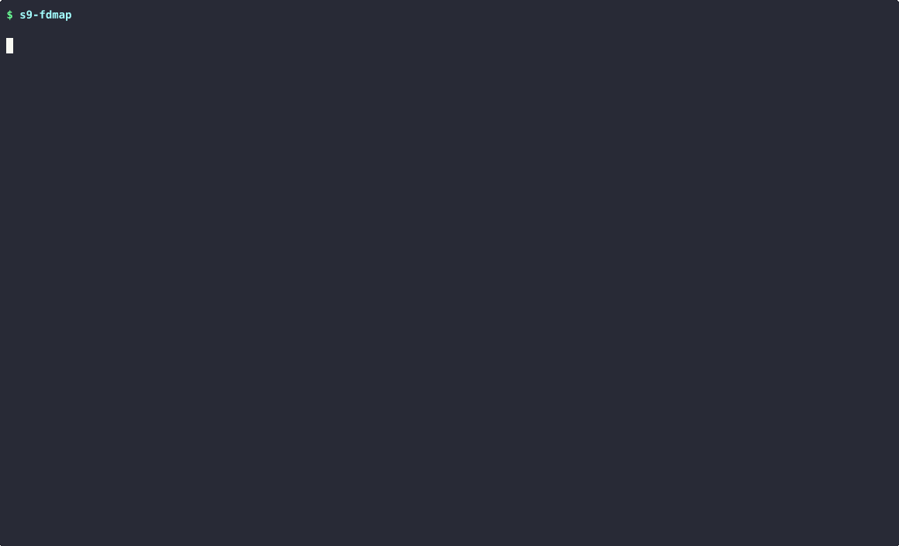

# Substrata9

[](https://github.com/iamrahulreddy/Substrata9/actions/workflows/ci.yml)
[](https://kernel.org)
[](https://www.gnu.org/software/bash/)
[](LICENSE)


**Deep process visibility for Linux**

Inspect memory usage, file descriptors, signal handlers, and process hierarchies through the `/proc` filesystem—without external dependencies. Written in pure Bash for transparency and portability.

---

## Demo

### Process Inspection


### File Descriptor Analysis


> 📺 **[See all demos with explanations →](docs/USAGE.md)**

---

## Quick Start

```bash
git clone https://github.com/iamrahulreddy/Substrata9.git
cd Substrata9
chmod +x bin/*
./bin/s9-inspect $$
```

### System-Wide Install (Optional)
```bash
sudo make install
```

---

## Toolkit

| Tool | Description |
|------|-------------|
| **s9-inspect** | Deep inspection of a single process (memory, FDs, limits, signals) |
| **s9-tree** | Process hierarchy visualization with resource context |
| **s9-fdmap** | System-wide FD analysis and leak detection |
| **s9-snapshot** | Capture and compare process state over time |
| **s9-compare** | Side-by-side comparison of two processes |
| **s9-anomaly** | Detect zombies, orphans, and resource hogs |

All tools support `--json` for scripting and `--help` for usage.

---

## Examples

```bash
# Inspect a process
s9-inspect nginx

# Find FD leaks
s9-fdmap --leaks --threshold 100

# Track changes over time
s9-snapshot capture $(pgrep myapp) --name before
# ... do work ...
s9-snapshot capture $(pgrep myapp) --name after
s9-snapshot diff before after

# System health check
s9-anomaly
```

---

## Requirements

- **OS:** Linux (Kernel 4.15+)
- **Shell:** Bash 4.0+
- **Utils:** `awk`, `sed`, `grep`, `bc`
- **Optional:** `jq` for JSON processing

### Windows (WSL)

> ⚠️ WSL creates an isolated Linux environment. Substrata9 inspects **Linux processes inside WSL**, not Windows host processes.

```bash
# In WSL terminal
git clone https://github.com/iamrahulreddy/Substrata9.git
cd Substrata9 && chmod +x bin/* && ./bin/s9-inspect $$
```

---

## Documentation

| Document | Description |
|----------|-------------|
| [Usage Guide](docs/USAGE.md) | Complete CLI reference with demos |
| [JSON Schema](docs/JSON_OUTPUT.md) | Output structure for scripting |
| [Architecture](docs/ARCHITECTURE.md) | Technical design |
| [Troubleshooting](docs/TROUBLESHOOTING.md) | Common issues |

---

## Performance

> **Designed for interactive diagnostics, not continuous monitoring.**

✅ Perfect for: Debugging, one-off diagnostics, learning Linux internals  
⚠️ Not ideal for: High-frequency monitoring, production systems

For high-performance monitoring: `htop`, `sysdig`, `procs` (Rust)

---

## Contributing

```bash
make test  # Run tests before submitting
```

See [CONTRIBUTING.md](CONTRIBUTING.md) for guidelines.

---

## About

**Substrata** (Latin: "spread beneath") + **9** (Unix Section 9) = Looking beneath userspace to expose process-level internals.

---

## Author

**Muskula Rahul** — [@iamrahulreddy](https://github.com/iamrahulreddy)

---

## License

[MIT](LICENSE)
