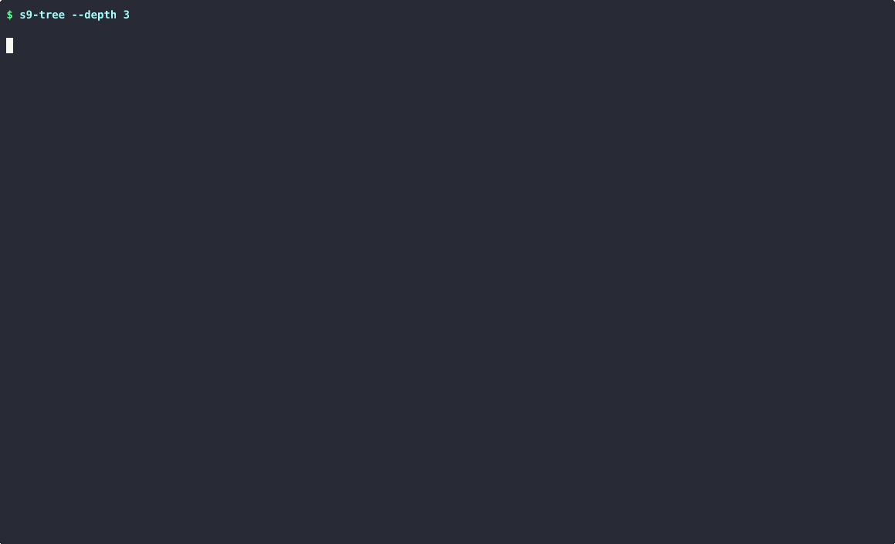

# Substrata9 Usage Guide

Comprehensive reference for all tools in the Substrata9 toolkit, with practical examples and real-world context.

> 💡 **See the tools in action!** Check out the [animated demos in the README](../README.md#-demo) or browse the [GIFS/](../GIFS/) folder.

---


## Prerequisites

Requirements:

| Requirement | Details |
|-------------|---------|
| **Operating System** | Linux (Kernel 4.15+, ideally 5.4+) |
| **Shell** | Bash 4.0 or newer |
| **Privileges** | Root/sudo recommended for full visibility into all processes |
| **Dependencies** | `awk`, `sed`, `grep`, `bc` — standard on most systems |

> **Note:** Many `/proc` files require root access. Run with `sudo` for complete visibility.

---


## s9-inspect — Process Inspection

**Function:** Comprehensive inspection of a single process — memory usage, open files, signal handlers, resource limits, and I/O statistics.

**Use case:** Deep analysis of a specific process's behavior and resource consumption.


### Syntax

```bash
s9-inspect <PID | process_name> [options]
```


### Options

| Option | What It Does |
|--------|--------------|
| `-f, --full` | Include detailed memory map (heap, stack, shared libraries) |
| `-e, --env` | Show the process's environment variables |
| `--json` | Output as JSON for scripting |
| `-h, --help` | Show help message |
| `-v, --version` | Show version |


### Examples

```bash
# Inspect by PID — the most direct approach
s9-inspect 1234

# Inspect by name — the tool will find the PID
s9-inspect nginx

# Inspect your current shell (useful for testing)
s9-inspect $$

# Get the full memory map — see every mapped region
s9-inspect --full $(pgrep python)

# Include environment variables (careful: may contain secrets!)
s9-inspect --env 1234

# Output as JSON for piping to jq or other tools
s9-inspect 1234 --json | jq '.rss_kb'
```

### Demo


### Understanding the Output

The report is organized into sections:

| Section | What You'll Learn |
|---------|-------------------|
| **IDENTITY** | Basic info: PID, name, state, parent process, user, start time |
| **MEMORY** | Virtual size, resident memory (RSS), and how much of system RAM it's using |
| **FILE DESCRIPTORS** | Every open file, socket, and pipe — great for finding leaks |
| **SIGNALS** | Which signals are blocked, ignored, or have handlers installed |
| **LIMITS** | Resource limits (ulimits) — max open files, max memory, etc. |
| **I/O STATS** | Bytes read/written and syscall counts (requires root) |

---


## s9-tree — Process Hierarchy

**Function:** Visualizes parent-child relationships between processes.

**Use case:** Understanding process spawning patterns and service ancestry.


### Syntax

```bash
s9-tree [options]
```


### Options

| Option | What It Does |
|--------|--------------|
| `-p, --pid <PID>` | Start the tree from this process instead of PID 1 |
| `-u, --user <USER>` | Only show processes owned by this user |
| `-d, --depth <N>` | Limit how deep the tree goes |
| `-t, --threads` | Include thread counts for each process |
| `--no-memory` | Hide memory statistics |
| `--no-state` | Hide process state indicators |
| `--json` | Output as JSON |


### Process State Codes

The tree shows each process's state with color coding:

| Code | Color | Meaning |
|------|-------|---------|
| `[R]` | 🟢 Green | Running — actively using CPU |
| `[S]` | 🔵 Cyan | Sleeping — waiting for something (normal) |
| `[D]` | 🟡 Yellow | Disk sleep — waiting for I/O (can't be killed) |
| `[Z]` | 🔴 Red | Zombie — dead but not reaped by parent |
| `[T]` | 🟡 Yellow | Stopped — paused by signal or debugger |
| `[t]` | 🟣 Magenta | Tracing — being debugged |


### Examples

```bash
# Show the full system tree starting from init/systemd
s9-tree

# Start from a specific process — see its children
s9-tree --pid 1234

# Filter to just one user's processes
s9-tree --user www-data

# Limit depth to avoid overwhelming output
s9-tree --user www-data --depth 3

# Include thread counts
s9-tree --threads

# Clean output for scripting
s9-tree --no-memory --no-state
```

### Demo




### Real-World Scenario

*"Why are there 50 python processes running?"*

```bash
# Find the parent that's spawning them all
s9-tree --pid $(pgrep -o python)
# → Shows the process tree rooted at the oldest python process
```

---


## s9-fdmap — File Descriptor Analysis

**Function:** System-wide file descriptor scanning for leak detection and file/socket ownership identification.

**Use case:** Diagnosing "too many open files" errors or identifying file locks.


### Syntax

```bash
s9-fdmap [options]
```


### Options

| Option | What It Does |
|--------|--------------|
| `--file <PATH>` | Find which processes have this file open |
| `--socket <PORT>` | Find which processes are using this port |
| `--leaks` | Scan for processes with suspiciously high FD counts |
| `--threshold <N>` | FD count threshold for leak detection (default: 100) |
| `--top <N>` | Show top N processes by FD count (default: 20) |
| `--json` | Output as JSON |


### Examples

```bash
# System-wide summary — who has the most FDs?
s9-fdmap

# Find who has a specific file open
s9-fdmap --file /var/log/syslog

# Find who's using port 8080
s9-fdmap --socket 8080

# Hunt for FD leaks — processes with unusually high counts
s9-fdmap --leaks --threshold 50

# Show top 50 FD consumers
s9-fdmap --top 50
```


### Understanding the Output

- **Summary mode:** Processes sorted by FD count (highest first)
- **Leak detection:** Shows breakdown by type — files, sockets, pipes, other
- **File search:** Shows PID, process name, FD number, and target path


### Real-World Scenario

*"We're getting 'too many open files' errors in production."*

```bash
# Step 1: Find the suspects
s9-fdmap --leaks --threshold 100

# Step 2: Deep dive on the worst offender
s9-inspect <PID> | grep -A 50 "FILE DESCRIPTORS"
# → See exactly what files/sockets are being held open
```

---


## s9-snapshot — Temporal Analysis

**Function:** Captures process state at a point in time for later comparison.

**Use case:** Tracking memory or FD growth over time to identify leaks.


### Syntax

```bash
s9-snapshot <command> [arguments]
```


### Commands

| Command | What It Does |
|---------|--------------|
| `capture <PID> --name <NAME>` | Save the current state of a process |
| `list` | Show all saved snapshots |
| `diff <NAME1> <NAME2>` | Compare two snapshots |
| `delete <NAME> [--force]` | Delete snapshots matching a name |


### Examples

```bash
# Capture a baseline snapshot
s9-snapshot capture 1234 --name baseline

# List all snapshots you've taken
s9-snapshot list

# Capture another snapshot after some time
s9-snapshot capture 1234 --name after_load

# Compare them — see what changed
s9-snapshot diff baseline after_load

# Clean up old snapshots
s9-snapshot delete baseline --force
```


### Workflow: Memory Leak Debugging

Standard workflow for tracking down a memory leak:

```bash
# Step 1: Find your process
pid=$(pgrep myapp)

# Step 2: Capture baseline (right after restart is ideal)
s9-snapshot capture $pid --name baseline

# Step 3: Let it run under load
sleep 3600  # Wait an hour, or run your load test

# Step 4: Capture the new state
s9-snapshot capture $pid --name after_load

# Step 5: See what grew
s9-snapshot diff baseline after_load
```


### Understanding the Diff Output

The diff shows changes with color coding:

| Color | Meaning |
|-------|---------|
| 🔴 Red | Significant growth — likely a leak |
| 🟡 Yellow | Moderate growth — worth investigating |
| 🟢 Green | Stable or decreased — probably fine |

Metrics compared:
- **Memory:** RSS, VmSize, Swap (with percentage change)
- **File Descriptors:** Count change
- **Threads:** Count change
- **I/O:** Read/write bytes (if available)


### Environment Variables

| Variable | What It Does |
|----------|--------------|
| `S9_SNAPSHOT_DIR` | Override where snapshots are stored (default: `~/.substrata9/snapshots`) |

---


## s9-anomaly — System Health Scanner

**Function:** System-wide scan for common issues — zombie processes, resource hogs, and unusual process states.

**Use case:** Routine health checks and initial issue diagnosis.


### Syntax

```bash
s9-anomaly [options]
```


### Options

| Option | What It Does |
|--------|--------------|
| `--zombies` | Only check for zombie processes |
| `--hogs` | Only check for resource hogs |
| `--states` | Only check for unusual process states |
| `--orphans` | Only check for orphan processes |
| `--mem-threshold <N>` | Memory threshold percentage (default: 80) |
| `--fd-threshold <N>` | FD count threshold (default: 500) |
| `--json` | Output as JSON |


### What It Checks

| Check | What It Finds |
|-------|---------------|
| **Zombies** | Dead processes waiting for their parent to call `wait()` |
| **Hogs** | Processes using excessive memory or file descriptors |
| **States** | Processes stuck in D-state (disk sleep), stopped, etc. |
| **Orphans** | User processes that got adopted by init (parent died) |


### Examples

```bash
# Run all checks — good for daily health monitoring
s9-anomaly

# Just looking for zombies?
s9-anomaly --zombies

# Find memory hogs with a lower threshold
s9-anomaly --hogs --mem-threshold 50 --fd-threshold 100

# Check for stuck processes (D-state)
s9-anomaly --states

# Output as JSON for alerting systems
s9-anomaly --json
```


### Real-World Scenario

*"The server feels sluggish but I don't know why."*

```bash
# Quick health check
s9-anomaly

# → Might reveal:
#   - Zombie processes piling up (parent not reaping)
#   - A process using 90% of RAM
#   - Processes stuck in D-state (waiting for slow disk)
```

---


## Troubleshooting

### "Permission Denied" Errors

Many `/proc` files are only readable by root. This is a Linux security feature, not a bug.

```bash
# Solution: Run with sudo
sudo s9-inspect 1234
sudo s9-fdmap --leaks
```


### "Command not found"

The tools aren't in your PATH. You have three options:

```bash
# Option 1: Add to PATH temporarily
export PATH="$PATH:/path/to/Substrata9/bin"

# Option 2: Use relative paths
./bin/s9-inspect 1234

# Option 3: Install system-wide
sudo make install
```


### "Process not found"

Processes are transient — they might exit between when you type the command and when it runs.

```bash
# Use pgrep to get the current PID
s9-inspect $(pgrep -n nginx)

# Or just use the name — the tool will find it
s9-inspect nginx
```


### Scripts Not Executable

```bash
chmod +x bin/*
chmod +x examples/*
```


### Still Stuck?

Check the [Troubleshooting Guide](TROUBLESHOOTING.md) for more solutions, or [open an issue](https://github.com/iamrahulreddy/Substrata9/issues).

---


## Advanced Usage

### Combining Tools

Tools can be combined for more complex workflows:

```bash
# Find memory hogs, then inspect the worst one
s9-anomaly --hogs 2>/dev/null | head -5
s9-inspect $(s9-anomaly --hogs 2>/dev/null | awk 'NR==4 {print $1}')

# Monitor a process over time
pid=$(pgrep myapp)
s9-snapshot capture $pid --name t0
sleep 300
s9-snapshot capture $pid --name t1
s9-snapshot diff t0 t1
```


### Scripting with JSON Output

All tools support `--json` for easy integration:

```bash
#!/bin/bash
# Alert on high FD count

THRESHOLD=1000

s9-fdmap --json | jq -r '.summary[] | select(.fd_count > '$THRESHOLD') | "\(.name) (PID \(.pid)) has \(.fd_count) FDs"'
```


### Automated Health Check

```bash
#!/bin/bash
# Daily system health check — run from cron

echo "=== Substrata9 Daily Health Report ==="
echo "Date: $(date)"
echo ""

echo "--- Zombie Check ---"
s9-anomaly --zombies

echo ""
echo "--- Resource Hogs ---"
s9-anomaly --hogs --mem-threshold 70

echo ""
echo "--- Top FD Consumers ---"
s9-fdmap --top 10
```

---


## See Also

- [Architecture Guide](ARCHITECTURE.md) — How Substrata9 works under the hood
- [JSON Output Reference](JSON_OUTPUT.md) — Schema documentation for `--json` output
- [Troubleshooting](TROUBLESHOOTING.md) — Common issues and solutions
- [Examples](../examples/) — Ready-to-use debugging scripts
- [Contributing](../CONTRIBUTING.md) — How to contribute

---

*Part of Substrata9 — Linux Process Archaeology Toolkit*
